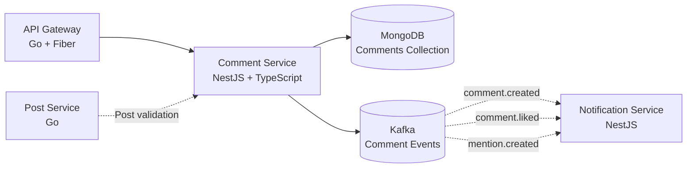

<p align="center">
  
</p>

<p align="center">
  
  
  
  
  
</p>

---

## 📝 Overview

**Comment Service** manages threaded discussions and replies for the A4AD Forum. It supports nested comment trees, soft deletion, likes on comments, and real-time notifications via Kafka events. Built with MongoDB for flexible document storage.

---

## ✨ Features

- 💬 **Threaded Comments** — Nested reply system with unlimited depth
- 🌳 **Comment Trees** — Efficient retrieval of comment hierarchies
- 👍 **Comment Likes** — Like/unlike system with counters
- 🗑️ **Soft Deletion** — Comments marked as deleted but preserved
- 📄 **Pagination** — Cursor-based pagination for large threads
- 🔍 **Mention Support** — @username mentions with notifications
- 📊 **Comment Stats** — Track likes, replies, and engagement
- ⚡ **Real-time Events** — Kafka events for comment notifications

---

## 🛠 Tech Stack

- **Framework:** NestJS 10+
- **Language:** TypeScript 5.0+
- **Database:** MongoDB 7+
- **ODM:** Mongoose / @nestjs/mongoose
- **Validation:** class-validator + class-transformer
- **Events:** Kafka (@nestjs/microservices)
- **Testing:** Jest + Supertest
- **Documentation:** Swagger/OpenAPI

---

## 📊 Architecture



---

## 🚀 Quick Start

### Prerequisites

- Node.js 20+
- pnpm (recommended) or npm
- MongoDB 7+
- Docker & Docker Compose (optional)

### Installation

1. **Clone the repository:**
   ```bash
   git clone https://github.com/A4AD-team/comment-service.git
   cd comment-service
   ```

2. **Install dependencies:**
   ```bash
   pnpm install
   # or: npm install
   ```

3. **Start MongoDB:**
   ```bash
   docker compose up -d mongodb
   ```

4. **Configure environment:**
   ```bash
   cp .env.example .env
   # Edit .env with your MongoDB connection string
   ```

5. **Run the service:**
   ```bash
   # Development mode with hot reload
   pnpm run start:dev

   # Production build
   pnpm run build
   pnpm run start:prod
   ```

The service will be available at `http://localhost:8084`

---

## 🔧 Environment Variables

| Variable | Description | Default | Required |
|----------|-------------|---------|----------|
| `NODE_ENV` | Environment (development, production) | `development` | No |
| `PORT` | HTTP server port | `8084` | No |
| `MONGODB_URI` | MongoDB connection string | `mongodb://localhost:27017/comment_db` | Yes |
| `MONGODB_DB_NAME` | MongoDB database name | `comment_db` | No |
| `JWT_SECRET` | JWT validation secret | `` | Yes |
| `KAFKA_BROKERS` | Kafka broker addresses | `localhost:9092` | No |
| `KAFKA_CLIENT_ID` | Kafka client ID | `comment-service` | No |
| `KAFKA_GROUP_ID` | Kafka consumer group | `comment-service-group` | No |
| `MAX_COMMENT_DEPTH` | Maximum nesting depth | `10` | No |
| `MAX_COMMENT_LENGTH` | Maximum comment length | `10000` | No |
| `COMMENTS_PER_PAGE` | Default pagination limit | `50` | No |
| `ENABLE_SOFT_DELETE` | Enable soft deletion | `true` | No |
| `LOG_LEVEL` | Logging level | `info` | No |
| `SWAGGER_ENABLED` | Enable Swagger docs | `true` | No |

---

## 📡 API Endpoints

### Comments

| Method | Path | Description | Auth Required |
|--------|------|-------------|---------------|
| `GET` | `/api/v1/comments` | List comments for a post (query: `?postId=xxx`) | No |
| `POST` | `/api/v1/comments` | Create a new comment | Yes |
| `GET` | `/api/v1/comments/:id` | Get single comment with replies | No |
| `PATCH` | `/api/v1/comments/:id` | Update own comment | Yes |
| `DELETE` | `/api/v1/comments/:id` | Soft delete own comment | Yes |
| `POST` | `/api/v1/comments/:id/like` | Like a comment | Yes |
| `DELETE` | `/api/v1/comments/:id/like` | Unlike a comment | Yes |

### Query Parameters

| Parameter | Description | Default |
|-----------|-------------|---------|
| `postId` | Filter by post ID | Required for list |
| `limit` | Comments per page | `50` |
| `cursor` | Pagination cursor | `` |
| `sort` | Sort order: `newest`, `oldest`, `popular` | `newest` |
| `includeDeleted` | Include soft-deleted comments | `false` |

### Example Comment Response

```json
{
  "id": "comment-uuid",
  "postId": "post-uuid",
  "parentCommentId": null,
  "authorId": "user-uuid",
  "author": {
    "username": "johndoe",
    "avatarUrl": "https://cdn.example.com/avatars/johndoe.png"
  },
  "content": "This is a great post! Thanks for sharing.",
  "mentions": [],
  "likesCount": 15,
  "isLikedByMe": true,
  "repliesCount": 3,
  "isDeleted": false,
  "createdAt": "2026-02-11T10:30:00Z",
  "updatedAt": "2026-02-11T10:30:00Z",
  "replies": [
    {
      "id": "reply-uuid",
      "parentCommentId": "comment-uuid",
      "authorId": "user-uuid-2",
      "content": "I agree! Very helpful.",
      "likesCount": 5,
      "isDeleted": false
    }
  ]
}
```

---

## 🩺 Health Checks

| Endpoint | Method | Description |
|----------|--------|-------------|
| `/health` | `GET` | Overall health status |
| `/health/live` | `GET` | Liveness probe |
| `/health/ready` | `GET` | Readiness probe (checks MongoDB) |
| `/api/docs` | `GET` | Swagger API documentation |

### Example Response

```json
{
  "status": "ok",
  "timestamp": "2026-02-12T15:30:00Z",
  "version": "0.1.0",
  "checks": {
    "mongodb": "connected",
    "kafka": "connected"
  }
}
```

---

## 🧪 Testing

```bash
# Run all tests
pnpm test

# Run tests with coverage
pnpm test -- --coverage

# Run tests in watch mode
pnpm test:watch

# Run specific test
pnpm test -- comment.service.spec

# Run e2e tests
pnpm test:e2e
```

---

## 📄 License

This project is licensed under the MIT License — see the [LICENSE](LICENSE) file for details.

---

<p align="center">
  <strong>Built with ❤️ by A4AD Team</strong>
</p>
