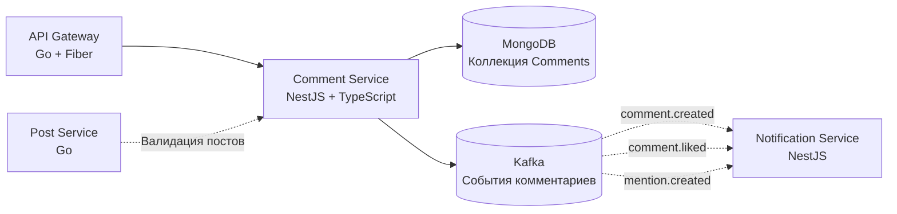

<p align="center">
  
</p>

<p align="center">
  
  
  
  
  
</p>

---

## 📝 Описание

**Comment Service** управляет древовидными обсуждениями и ответами для форума A4AD. Поддерживает вложенные деревья комментариев, мягкое удаление, лайки на комментариях и уведомления в реальном времени через события Kafka. Построен на MongoDB для гибкого хранения документов.

---

## ✨ Возможности

- 💬 **Древовидные комментарии** — Система вложенных ответов с неограниченной глубиной
- 🌳 **Деревья комментариев** — Эффективное получение иерархий комментариев
- 👍 **Лайки комментариев** — Система лайков с счётчиками
- 🗑️ **Мягкое удаление** — Комментарии помечаются как удалённые, но сохраняются
- 📄 **Пагинация** — Курсорная пагинация для больших веток
- 🔍 **Поддержка упоминаний** — Упоминания @username с уведомлениями
- 📊 **Статистика комментариев** — Отслеживание лайков, ответов и вовлечённости
- ⚡ **События в реальном времени** — События Kafka для уведомлений о комментариях

---

## 🛠 Технологический стек

- **Фреймворк:** NestJS 10+
- **Язык:** TypeScript 5.0+
- **База данных:** MongoDB 7+
- **ODM:** Mongoose / @nestjs/mongoose
- **Валидация:** class-validator + class-transformer
- **События:** Kafka (@nestjs/microservices)
- **Тестирование:** Jest + Supertest
- **Документация:** Swagger/OpenAPI

---

## 📊 Архитектура



---

## 🚀 Быстрый старт

### Требования

- Node.js 20+
- pnpm (рекомендуется) или npm
- MongoDB 7+
- Docker & Docker Compose (опционально)

### Установка

1. **Клонирование репозитория:**
   ```bash
   git clone https://github.com/A4AD-team/comment-service.git
   cd comment-service
   ```

2. **Установка зависимостей:**
   ```bash
   pnpm install
   # или: npm install
   ```

3. **Запуск MongoDB:**
   ```bash
   docker compose up -d mongodb
   ```

4. **Настройка окружения:**
   ```bash
   cp .env.example .env
   # Отредактируйте .env со строкой подключения к MongoDB
   ```

5. **Запуск сервиса:**
   ```bash
   # Режим разработки с горячей перезагрузкой
   pnpm run start:dev

   # Продакшен-сборка
   pnpm run build
   pnpm run start:prod
   ```

Сервис будет доступен по адресу `http://localhost:8084`

---

## 🔧 Переменные окружения

| Переменная | Описание | Значение по умолчанию | Обязательная |
|------------|----------|----------------------|--------------|
| `NODE_ENV` | Окружение (development, production) | `development` | Нет |
| `PORT` | Порт HTTP-сервера | `8084` | Нет |
| `MONGODB_URI` | Строка подключения к MongoDB | `mongodb://localhost:27017/comment_db` | Да |
| `MONGODB_DB_NAME` | Имя базы данных MongoDB | `comment_db` | Нет |
| `JWT_SECRET` | Секрет для валидации JWT | `` | Да |
| `KAFKA_BROKERS` | Адреса брокеров Kafka | `localhost:9092` | Нет |
| `KAFKA_CLIENT_ID` | ID клиента Kafka | `comment-service` | Нет |
| `KAFKA_GROUP_ID` | Группа потребителей Kafka | `comment-service-group` | Нет |
| `MAX_COMMENT_DEPTH` | Максимальная глубина вложенности | `10` | Нет |
| `MAX_COMMENT_LENGTH` | Максимальная длина комментария | `10000` | Нет |
| `COMMENTS_PER_PAGE` | Лимит пагинации по умолчанию | `50` | Нет |
| `ENABLE_SOFT_DELETE` | Включение мягкого удаления | `true` | Нет |
| `LOG_LEVEL` | Уровень логирования | `info` | Нет |
| `SWAGGER_ENABLED` | Включение Swagger-документации | `true` | Нет |

---

## 📡 Эндпоинты

### Комментарии

| Метод | Путь | Описание | Требуется авторизация |
|-------|------|----------|----------------------|
| `GET` | `/api/v1/comments` | Список комментариев к посту (query: `?postId=xxx`) | Нет |
| `POST` | `/api/v1/comments` | Создать новый комментарий | Да |
| `GET` | `/api/v1/comments/:id` | Получить комментарий с ответами | Нет |
| `PATCH` | `/api/v1/comments/:id` | Обновить свой комментарий | Да |
| `DELETE` | `/api/v1/comments/:id` | Мягкое удаление своего комментария | Да |
| `POST` | `/api/v1/comments/:id/like` | Лайкнуть комментарий | Да |
| `DELETE` | `/api/v1/comments/:id/like` | Убрать лайк с комментария | Да |

### Query-параметры

| Параметр | Описание | Значение по умолчанию |
|----------|----------|----------------------|
| `postId` | Фильтр по ID поста | Обязательно для списка |
| `limit` | Комментариев на страницу | `50` |
| `cursor` | Курсор пагинации | `` |
| `sort` | Порядок сортировки: `newest`, `oldest`, `popular` | `newest` |
| `includeDeleted` | Включать мягко удалённые комментарии | `false` |

### Пример ответа с комментарием

```json
{
  "id": "comment-uuid",
  "postId": "post-uuid",
  "parentCommentId": null,
  "authorId": "user-uuid",
  "author": {
    "username": "johndoe",
    "avatarUrl": "https://cdn.example.com/avatars/johndoe.png"
  },
  "content": "Отличный пост! Спасибо за публикацию.",
  "mentions": [],
  "likesCount": 15,
  "isLikedByMe": true,
  "repliesCount": 3,
  "isDeleted": false,
  "createdAt": "2026-02-11T10:30:00Z",
  "updatedAt": "2026-02-11T10:30:00Z",
  "replies": [
    {
      "id": "reply-uuid",
      "parentCommentId": "comment-uuid",
      "authorId": "user-uuid-2",
      "content": "Согласен! Очень полезно.",
      "likesCount": 5,
      "isDeleted": false
    }
  ]
}
```

---

## 🩺 Health Checks

| Эндпоинт | Метод | Описание |
|----------|-------|----------|
| `/health` | `GET` | Общий статус здоровья |
| `/health/live` | `GET` | Liveness-проба |
| `/health/ready` | `GET` | Readiness-проба (проверка MongoDB) |
| `/api/docs` | `GET` | Swagger-документация API |

### Пример ответа

```json
{
  "status": "ok",
  "timestamp": "2026-02-12T15:30:00Z",
  "version": "0.1.0",
  "checks": {
    "mongodb": "connected",
    "kafka": "connected"
  }
}
```

---

## 🧪 Тестирование

```bash
# Запуск всех тестов
pnpm test

# Запуск с покрытием
pnpm test -- --coverage

# Запуск в режиме наблюдения
pnpm test:watch

# Запуск конкретного теста
pnpm test -- comment.service.spec

# Запуск e2e тестов
pnpm test:e2e
```

---

## 📄 Лицензия

Проект распространяется под лицензией MIT — подробности в файле [LICENSE](LICENSE).

---

<p align="center">
  <strong>Создано с ❤️ командой A4AD</strong>
</p>
